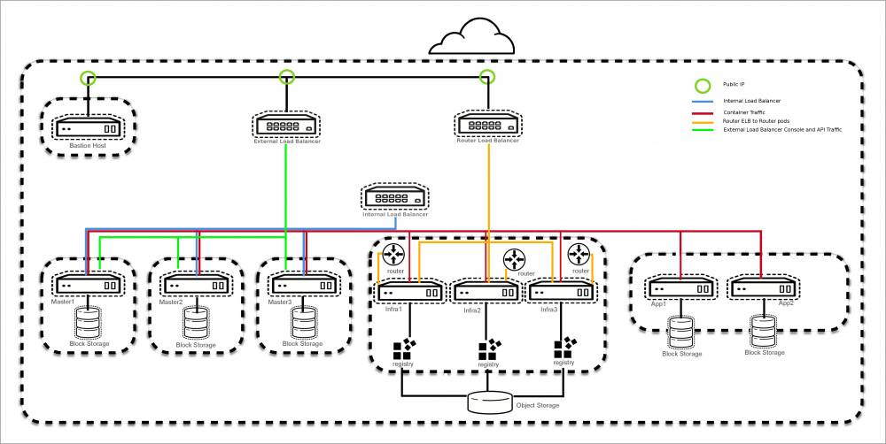

# AWS Installer

This installer sets up OpenShift on AWS in a HA configuration. This is a summary of the [official documentation](https://access.redhat.com/documentation/en-us/reference_architectures/2017/html-single/deploying_and_managing_openshift_container_platform_3.6_on_amazon_web_services/)

In the end you'll have the following.



You will need the following to get started
  * An AWS IAM account
    * This account pretty much needs full access
    * AWS Secret Key
    * AWS Key ID
  * Delegate a Subdomain to AWS Route53
  * OpenShift Subs
  * A host to launch the commands from

## Set Up Host

First install the following packages

```
subscription-manager register --username=christian.hernandez@redhat.com
subscription-manager list --available
subscription-manager attach --pool <pool id>
subscription-manager repos --disable=*
subscription-manager repos --enable rhel-7-server-rpms
subscription-manager repos --enable rhel-7-server-optional-rpms
subscription-manager repos --enable rhel-7-server-ose-3.5-rpms
subscription-manager repos --enable rhel-7-fast-datapath-rpms
yum -y install yum-utils
yum install -y https://dl.fedoraproject.org/pub/epel/epel-release-latest-7.noarch.rpm
yum-config-manager --disable epel
yum -y install ansible atomic-openshift-utils
yum -y install --enablerepo=epel \
                 python2-boto \
                 python2-boto3 \
                 pyOpenSSL \
                 git \
                 python-netaddr \
                 python-click \
                 python-httplib2 vim bash-completion
```

Next, either copy or create an ssh-key; below is how to generate an SSH key (skip this if you already have one)

```
ssh-keygen
```

Create an `~/.ssh/config` file with the following (substitute your delegated domain and ssh key where appropriate)

```
Host bastion
     HostName                 bastion.aws.chx.cloud
     User                     ec2-user
     StrictHostKeyChecking    no
     ProxyCommand             none
     CheckHostIP              no
     ForwardAgent             yes
     IdentityFile             /root/.ssh/id_rsa

Host *.aws.chx.cloud
     ProxyCommand             ssh ec2-user@bastion -W %h:%p
     user                     ec2-user
     IdentityFile             /root/.ssh/id_rsa
```

You are basically setting up a way to "tunnel" through your env.

Next, clone the repo

```
cd
git clone https://github.com/openshift/openshift-ansible-contrib.git
```

This env is going to use GitHub for auth. Create an Org (this is easy). Then Go to `Settings ~> oAuth Applications` and register a new app. I used the following settings

```
Homepage URL: https://openshift-master.aws.chx.cloud
Authorization callback URL: https://openshift-master.aws.chx.cloud/oauth2callback/github
```


## Provision The Environment

To provision the env; you need to be in the right dir. Enter the dir and run the help menu. For the most, part it's well documented

```
sudo setenforce 0
cd openshift-ansible-contrib/reference-architecture/aws-ansible
./ose-on-aws.py --help
```

**NOTE**
I had to edit the following file `openshift-ansible-contrib/reference-architecture/aws-ansible/inventory/aws/hosts/ec2.ini` and change the entry (around line 14) `regions = all` to the entry below (substitute for your region). This is a current bug and you may not need to do this. Check the [[https://github.com/openshift/openshift-ansible-contrib/issues/369|issues]] page for info. __UPDATE__: I hadn't had to do this the last two times i've ran this but YMMV.

```
regions = us-east-1
```

Export your AWS env
```
export AWS_SECRET_ACCESS_KEY=XXXXXXXXXXXXXXXXXXXXXXXXX
export AWS_ACCESS_KEY_ID=XXXXXXXXXXXXXXXXXXXX
```

I ran the following to provision the env. (I used TMUX so I can disconnect and comeback later)

```
./ose-on-aws.py \
--stack-name=ocp-chx \
--ami=ami-b63769a1 \
--region=us-east-1 \
--public-hosted-zone=aws.chx.cloud \
--app-dns-prefix=apps \
--rhsm-user=christian.hernandez@redhat.com \
--rhsm-password=rhsecret \
--rhsm-pool="Employee SKU" \ 
--github-client-secret=githubclientsecret \
--github-client-id=githubclientid \
--github-organization=openshift-tigerteam \
--keypair=chernand-ec2 \
--create-key=yes \
--key-path=/root/.ssh/id_rsa.pub
```

Things to note

  * If you want another github org just pass multiple `--github-organization`
  * The `--keypair` is the NAME you want it in AWS
  * And `--create-key` means that you're going to upload this to AWS
  * The option `--rhsm-pool` cloud be `"60 Day Supported OpenShift Enterprise, 2 Cores Evaluation"`
  * You probably want to pass `--node-instance-type` and/or `--app-instance-type` and chose either `m4.xlarge` for 10-20 users or `m4.2xlarge` for 20-40 users (more expensive but enough resources)

## Add A Node

Adding a node is easy. Just make sure you're in that same dir

```
./add-node.py \
--existing-stack=ocp-chx \
--rhsm-user=christian.hernandez@redhat.com \
--rhsm-password=rhsecret \
--public-hosted-zone=aws.chx.cloud \
--keypair=chernand-ec2 \
--rhsm-pool="Employee SKU" \
--use-cloudformation-facts \
--shortname=ose-app-node03 \
--subnet-id=subnet-67cefb05 
```

Two things to note
  * Use the proper `--shortname` - just look on AWS
  * The `--subnet-id` means what zone you want it in...makes sure it's what you want.
