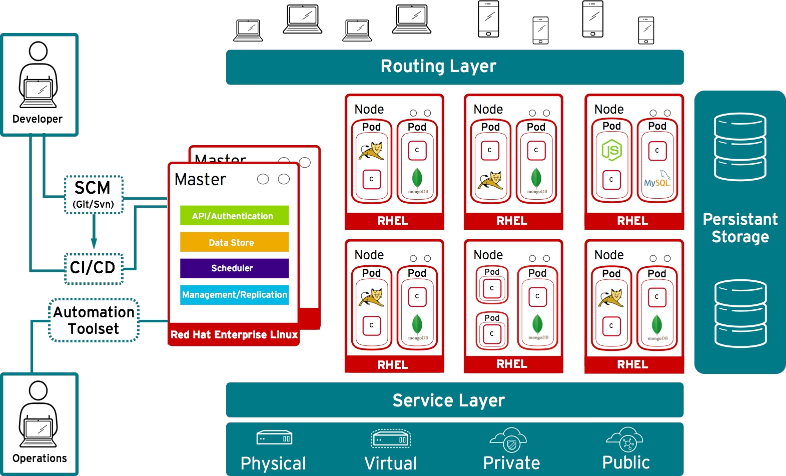

# Installation

The installation of OpenShift Container Platform (OCP); will be done via ansible. More information can be found using the OpenShift [documentation site](https://docs.openshift.com/container-platform/latest/welcome/index.html).

* [Infrastrucure](#infrastrucure)
* [Host preparation](#host-preparation)
* [Docker Configuration](#docker-configuration)
* [Ansible Installer](#ansible-installer)
* [Running The Playbook](#running-the-playbook)
* [AWS Installer](#aws-installer)
* [Package Excluder](#package-excluder)
* [Uninstaller](#uninstaller)

## Infrastrucure 

For this installation we have the following

* Wildcard DNS entry like `*.apps.example.com`
* Servers installed with RHEL 7.x (latest RHEL 7 version) with a "minimum" install profile.
* Forward/Reverse DNS is a MUST for master/nodes
* SELinux should be enforcing
* Firewall should be running.
* NetworkManager 1.0 or later
* Masters
  * 4CPU
  * 16GB RAM
  * Disk 0 (Root Drive) - 50GB
  * Disk 1 - 100GB Raw/Unformatted  (runs docker containers)
* Nodes
  * 4CPU
  * 16GB RAM
  * Disk 0 (Root Drive) - 50GB
  * Disk 1 - 100GB Raw/Unformatted  (runs docker containers)
  * Disk 2 - 500GB Raw/Unformatted (for Container Native Storage)

Here is a diagram of how OCP is layed out



## Host preparation

Each host must be registered using RHSM and have an active OCP subscription attached to access the required packages.

On each host, register with RHSM:

```
subscription-manager register --username=${user_name} --password=${password}
```

List the available subscriptions:

```
subscription-manager list --available
```

In the output for the previous command, find the pool ID for an OpenShift Enterprise subscription and attach it:

```
subscription-manager attach --pool=${pool_id}
```

Disable all repositories and enable only the required ones:

```
subscription-manager repos  --disable=*
yum-config-manager --disable \*
subscription-manager repos \
    --enable="rhel-7-server-rpms" \
    --enable="rhel-7-server-extras-rpms" \
    --enable="rhel-7-server-ose-3.11-rpms" \
    --enable="rhel-7-server-ansible-2.6-rpms"
```

Make sure the pre-req pkgs are installed/removed and make sure the system is updated

```
yum -y install wget git net-tools bind-utils yum-utils iptables-services bridge-utils bash-completion kexec-tools sos psacct vim
yum -y update
systemctl reboot
yum -y install openshift-ansible
```

Then install docker when it comes back up. Make sure you're running the version it states in the docs

```
yum -y install docker-1.13.1
docker version
```

If you're planning on using gluster; update the default package to the latest version

```
subscription-manager repos --enable=rh-gluster-3-client-for-rhel-7-server-rpms
yum -y update glusterfs-fuse
```

## Docker Configuration

Next configure docker storage.

Docker’s default loopback storage mechanism is not supported for production use and is only appropriate for proof of concept environments. For production environments, you must create a thin-pool logical volume and re-configure docker to use that volume.

You can use the docker-storage-setup script to create a thin-pool device and configure docker’s storage driver after installing docker but before you start using it. The script reads configuration options from the `/etc/sysconfig/docker-storage-setup` file.

Configure docker-storage-setup for your environment. There are three options available based on your storage configuration:

a) Create a thin-pool volume from the remaining free space in the volume group where your root filesystem resides; this requires no configuration:

`# docker-storage-setup`

b) Use an existing volume group, in this example docker-vg, to create a thin-pool:

```
# echo <<EOF > /etc/sysconfig/docker-storage-setup
VG=docker-vg
SETUP_LVM_THIN_POOL=yes
DATA_SIZE=90%FREE
WIPE_SIGNATURES=true
EOF
# docker-storage-setup
```

c) Use an unpartitioned block device to create a new volume group and thinpool. In this example, the /dev/vdc device is used to create the docker-vg volume group:

```
# cat <<EOF > /etc/sysconfig/docker-storage-setup
DEVS=/dev/vdc
VG=docker-vg
DATA_SIZE=90%FREE
WIPE_SIGNATURES=true
EOF
# docker-storage-setup
```

Verify your configuration. You should have dm.thinpooldev value in the /etc/sysconfig/docker-storage file and a docker-pool device:

```
# lvs
LV                  VG        Attr       LSize  Pool Origin Data%  Meta% Move Log Cpy%Sync Convert
docker-pool         docker-vg twi-a-tz-- 48.95g             0.00   0.44
# cat /etc/sysconfig/docker-storage
DOCKER_STORAGE_OPTIONS=--storage-opt dm.fs=xfs --storage-opt dm.thinpooldev=/dev/mapper/docker--vg-docker--pool
```

Re-initialize docker.

**Warning** This will destroy any docker containers or images currently on the host.
```
    # systemctl stop docker
    # vgremove -ff docker-vg
    # rm -rf /var/lib/docker/*
    # wipefs -a /path/to/dev
    # cat /dev/null > /etc/sysconfig/docker-storage
    # docker-storage-setup
    # systemctl restart docker
```

## Ansible Installer

On The master host, generate ssh keys to use for ansible press enter to accept the defaults

```
root@master# ssh-keygen
```

Distribue these keys to all hosts (including the master)

```
root@master# for host in ose3-master.example.com \
    ose3-node1.example.com \
    ose3-node2.example.com; \
    do ssh-copy-id -i ~/.ssh/id_rsa.pub $host; \
    done
```

Test passwordless ssh

```
root@master# for host in ose3-master.example.com \
    ose3-node1.example.com \
    ose3-node2.example.com; \
    do ssh $host hostname; \
    done
```

Make a backup of the `/etc/ansible/hosts` file

```
cp /etc/ansible/hosts{,.bak}
```

Next You must create an `/etc/ansible/hosts` file for the playbook to use during the installation

Sample Ansible Hosts files
  * [Single Master](https://raw.githubusercontent.com/christianh814/openshift-toolbox/master/ansible_hostfiles/singlemaster)
  * [Multi Master](https://raw.githubusercontent.com/christianh814/openshift-toolbox/master/ansible_hostfiles/multimaster)
  * [AWS Install](https://raw.githubusercontent.com/christianh814/openshift-toolbox/master/ansible_hostfiles/awsinstall)
  * [GluserFS Config](https://raw.githubusercontent.com/christianh814/openshift-toolbox/master/ansible_hostfiles/glusterfs)

Sample HAProxy configs if you want to build your own HAProxy server
  * [HAProxy Config](https://raw.githubusercontent.com/christianh814/openshift-toolbox/master/haproxy_config/haproxy.cfg)
  * [HAProxy with Let's Encrypt](https://raw.githubusercontent.com/christianh814/openshift-toolbox/master/haproxy_config/haproxy-letsencrypt.cfg)

If you used let's encrypt, you might find [these crons](../certbot) useful

## Running The Playbook

You can run the playbook (specifying a `-i` if you wrote the hosts file somewhere else) at this point

First run the prereq playbook

```
root@master# ansible-playbook /usr/share/ansible/openshift-ansible/playbooks/prerequisites.yml
```

Now run the installer afterwards

```
root@master# ansible-playbook /usr/share/ansible/openshift-ansible/playbooks/deploy_cluster.yml
```

Once this completes successfully, run `oc get nodes` and you should see "Ready"

```
root@master# oc get nodes
NAME                      LABELS                                           STATUS
ose3-master.example.com   kubernetes.io/hostname=ose3-master.example.com   Ready
ose3-node1.example.com    kubernetes.io/hostname=ose3-node1.example.com    Ready
ose3-node2.example.com    kubernetes.io/hostname=ose3-node2.example.com    Ready
```

I also like to see all my pods statuses

```
oc get pods --all-namespaces
```

Label infra nodes if you need to...

```
oc label node infra1.cloud.chx node-role.kubernetes.io/infra=true
```

## AWS Installer

There is a script provided by RH, that provisions an fully HA env on AWS. You can find notes for that [Here](https://github.com/christianh814/openshift-toolbox/tree/master/aws_refarch)

## Package Excluder

OpenShift excludes packages during install, you may want to unexclude it at times (you probably never have to; but here's how to in any event)

```
atomic-openshift-excluder [ unexclude | exclude ]
```

## Uninstaller

If you need to "start over", you can uninstall OpenShift with the following playbook...

```
root@master# ansible-playbook /usr/share/ansible/openshift-ansible/playbooks/adhoc/uninstall.yml
```

Note that this may have unintended consequences (like destroying formatted disks, removing config files, etc). Run this only when needed.
